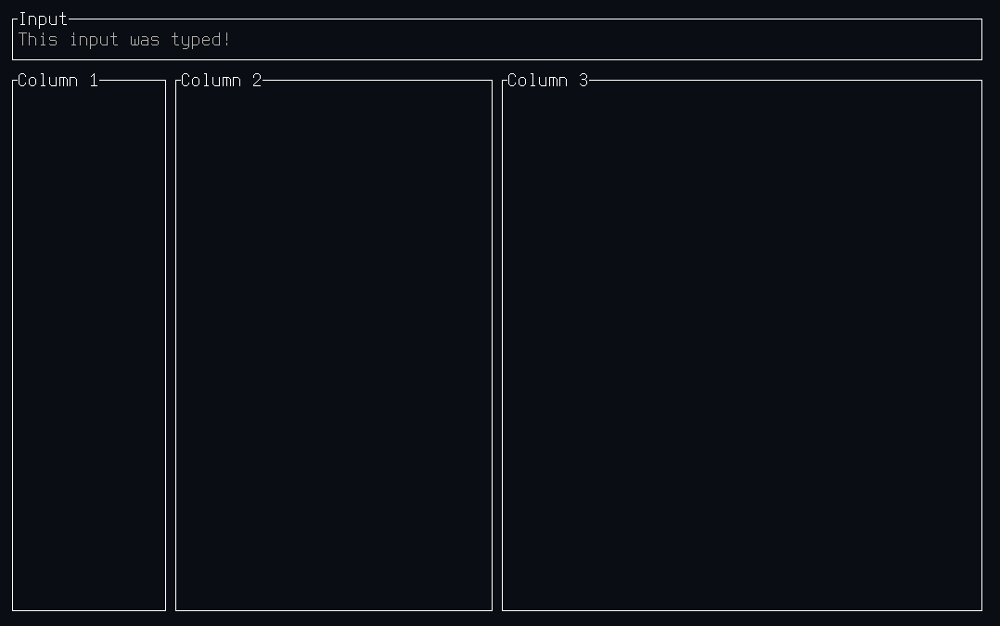

# Intuitive
Intuitive is a component-based library for creating text-based user interfaces
(TUIs) easily.

TODO(enricozb): put a gif here?

It is heavily inspired by [React](https://developer.apple.com/xcode/swiftui/) and
[SwiftUI](https://developer.apple.com/xcode/swiftui/), containing features that
resemble functional components, hooks, and a (mostly) declarative DSL.

# Design
The main focus of Intuitive is to simplify the implementation of section-based TUIs,
such as [lazygit](https://github.com/jesseduffield/lazygit)'s. Resizing is handled
automatically, and keyboard events can be handled easily.

For example, a complex layout with an input box:
```rust
use intuitive::{
  component,
  components::{Centered, Flex::*, Section, Text, VStack, HStack},
  error::Result,
  on_key, render,
  state::use_state,
  terminal::Terminal,
};

#[component(Root)]
fn render() {
  let text = use_state(|| String::new());
  let on_key = on_key! { [text]
    KeyEvent { code: Char(c), .. } => text.mutate(|text| text.push(c)),
    KeyEvent { code: Backspace, .. } => text.mutate(|text| text.pop()),
    KeyEvent { code: Esc, .. } => event::quit(),
  };

  render! {
    VStack(flex: [Block(3), Grow(1)], on_key: on_key) {
      Section(title: "Input") {
        Text(text: text.get())
      }

      HStack() {
        Section(title: "Column 1")
        Section(title: "Column 2")
        Section(title: "Column 3")
      }
    }
  }
}

fn main() -> Result<()> {
  Terminal::new(Root::new())?.run()
}
```
And the output would look like this:


